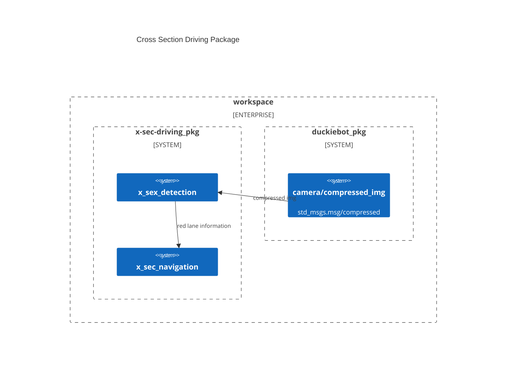

# x-sec-driving
ROS Package of crosssection driving

```mermaid
C4Context
title Cross Section Driving Package

Enterprise_Boundary(b1, "workspace") {

  System_Boundary(b2, "x-sec-driving_pkg") {
    System(SystemA, "x_sex_detection")
    System(SystemB, "x_sec_navigation")
  }

  System_Boundary(b3, "duckiebot_pkg", "boundary") {
    System(SystemC, "camera/compressed_img", "std_msgs.msg/compressed")
  }
}

Rel(SystemC, SystemA, "compressed img")
Rel(SystemA, SystemB, "red lane information")
```
