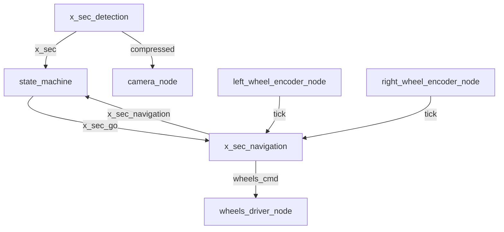
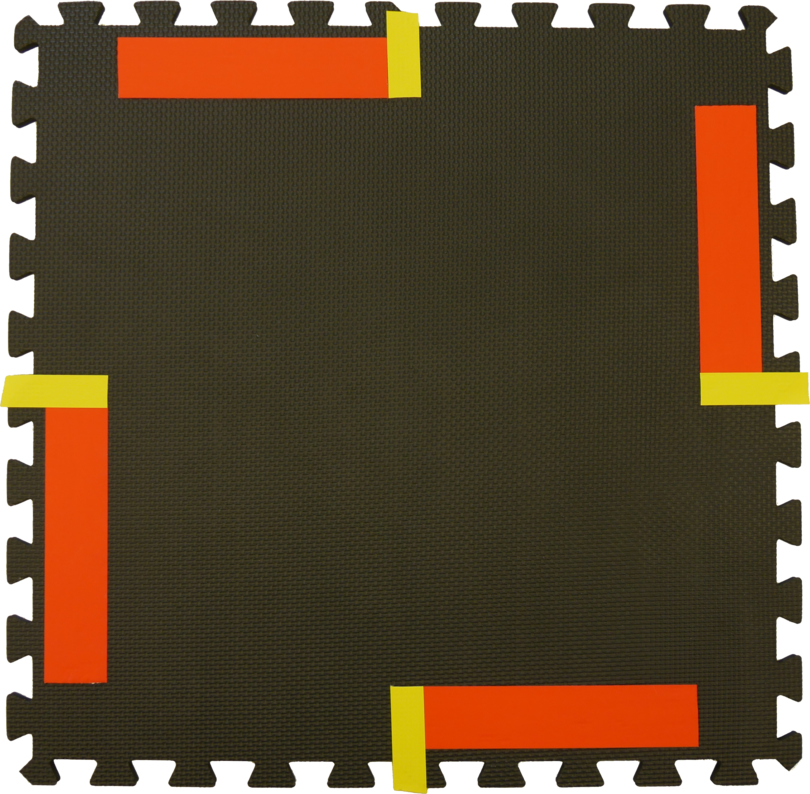
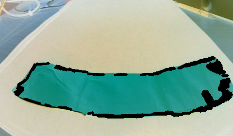
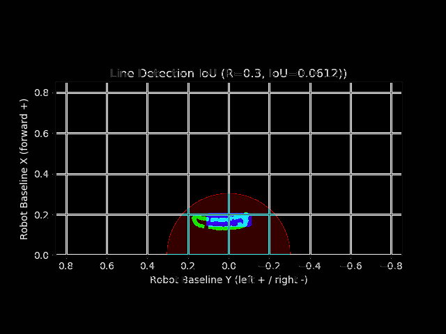
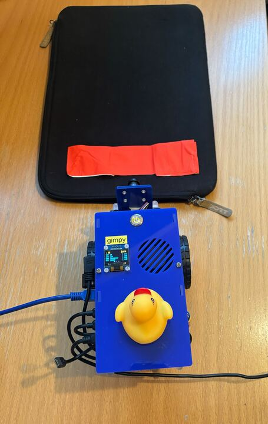
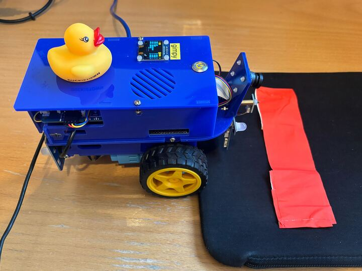
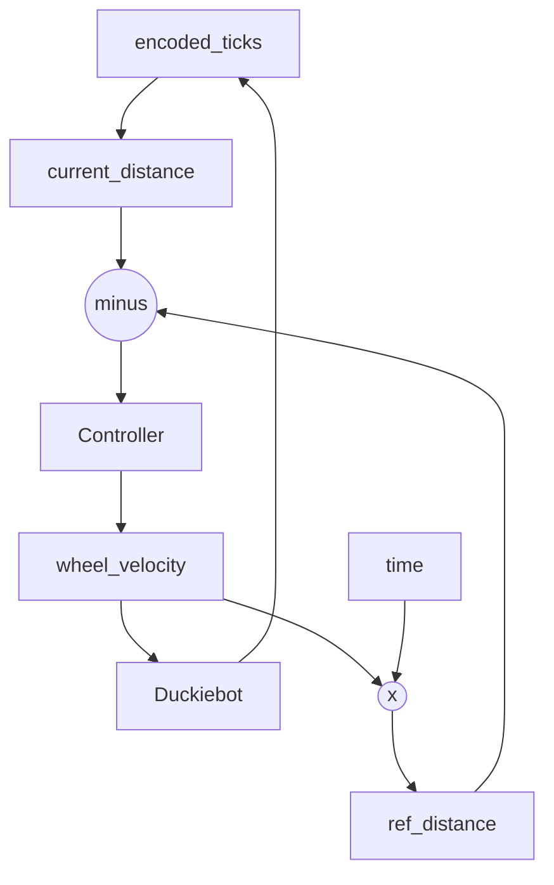

# x-sec-driving
ROS Package of crosssection driving

The cross section driving is part of the Quackman game and is incorporated as a rospackage. The package consists of two rosnodes `x_sec_detection` and `x_sec_navigation`. During operation the nodes are publishing and subscribing to the following topics. The architectures is given in the subsequent subchapter:

### Detection
#### PUBLISH
- `/quack_man/x_sec`: Crosssection detection flag.
- `/${VEHICLENAME}/xsec_detection/mask_red_lines/compressed`: Image with detected crosssection lines, used for evaluation.
- `/${VEHICLENAME}//xsec_detection/xsec_eval/compressed`: Graph plot of projected crossection lines, used for evaluation. 

#### SUBRSCRIBE
- `/${VEHICLENAME}/camera_node/image/compressed`: Image stream from rgb camera for crossection detection.

### Navigation
#### PUBLISH
- `/${VEHICLENAME}/wheels_driver_node/wheels_cmd`: Velocity commands for wheel driver.
- `/quack_man/x_sec_navigating`: Crossection navigation flag. Is set to `true` during crossection navigation. 
  
#### SUBSCRIBE
- `/quack_man/x_sec_go`: Crossection navigation start flag. 
- `/${VEHICLENAME}/left_wheel_encoder_node/tick`: Left wheel encoder ticks for feedback control.
- `/${VEHICLENAME}/right_wheel_encoder_node/tick`: Right wheel encoder ticks for feedback control.
  

## ROS Architecture

## Cross section tile

Cross section tile

## Cross section detection 
The detection algorithm of the crosssection tiles follows the process given in the table. It is fed by compressed rgb-images from the front camera of the duckiebit.

| **Step**                      | **Description**                                        | **Tuning Parameters**                                      |
|---|---|---|
| **Line detection** |
|---|---|---|
| 1. Crop Image                 | Remove unwanted parts of the image.                   | `top`, `bottom`, `left`, `right`                            |
| 2. Smoothen Image             | Reduce noise and enhance edges using Gaussian blur.   | `ksize` (kernel size), `threshold`                          |
| 3. Edge Detection             | Identify edges using the Canny algorithm.             | `low_threshold`, `high_threshold`                           |
| 4. Dilate Edge Mask           | Thicken edges to improve detection.                   | `kernel_size`, `iterations`                                 |
| 5. Color Dilated Edges        | Apply the edge mask to the original image.            | No specific parameter                                       |
| 6. Color Filtering for Edges  | Extract edges of the red color.                       | `HSV_RANGES_RED_1`, `HSV_RANGES_RED_2`                      |
| 7. Line Detection             | Detect line segments using Hough Line Transform.      | `rho`, `theta`, `threshold`, `minLineLength`, `maxLineGap`  |
| 8. Projection to Ground Plane | Project detected lines to the ground using homography.| `H` (homography matrix), `offset_x`, `offset_y`             |
|---|---|---|
| **Evaluation** |
|---|---|---|
| 1. Buffering Polygons                 | Convert detected lines to buffered polygons, and set their union. | `buffer_size`                           |
| 2. Ground truth Polygon            | Define ground truth union.   | `polygon_width`, `polygon_heigth `                        |
| 3. Score Area             | Define area at which detected lines are evaluated.  | `score_radius`                         |
| 4. Final score            | Get intersection of ground truth and detected polygons with the score area. Calculate then the intersection and the union of the yielded values and finally take the ratio of the intersecting over the unified areas.| `passing_threshold`                           |

Detected Line Segments

Evaluation of Xsec Detection

### Test Setup

## Crosssection navigation
The decision-making in the crosssection navigation is handled randomly and can only be used for 4-way crossections, mainly going `STRAIGHT`, `LEFT`, `RIGHT`. The three mission are split into commands, whereas a command consists of the following parameter. 
- `type` : moving `STRAIGHT`, in a `CURVE` or `ROTATE`
- `direction`: `POSITIVE` or `NEGATIVE`, wheres positive is either meant as forward (striaght) or clockwise (curve, rotate)
- `distance`: given either the distance in meter (straight) or in radians (curve, rotate)
- `radius`: only mandatory for a curve command. 
At the current state the controller only handles forward driving. 

The navigation driving is implemented with distance reference controller, one by each wheel. When the end distance is reached up to a certain threshold, final fine-adjustments are done. 
During navigation driving the `x_sec_navigation` flag is set to true until the mission is terminated, passing the command on to the state_controlle. 

