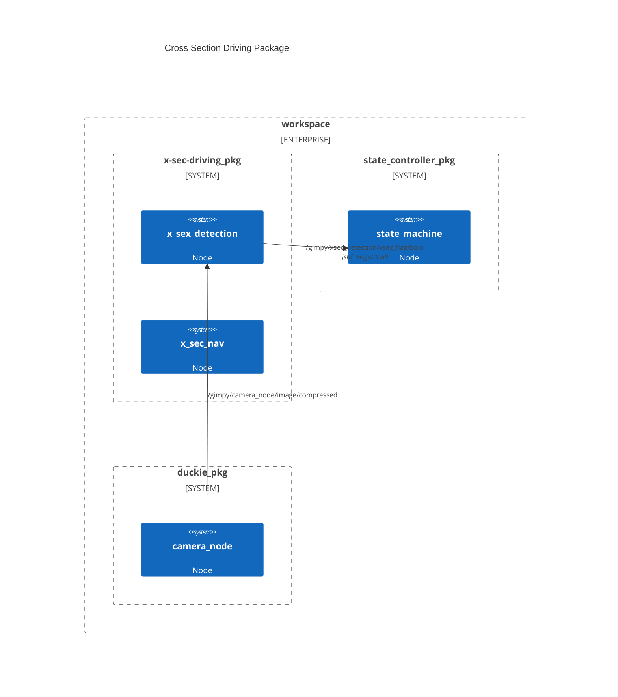

# x-sec-driving
ROS Package of crosssection driving

# ROS Architecture

# Cross section tile
![Cross section tile][media/4way_4_done.png]

# Cross section detection 
![Detected Line Segments][media/x_sec_detection.png]
![Evaluation of Xsec Detection][media/x_sec_detection_eval.png]

