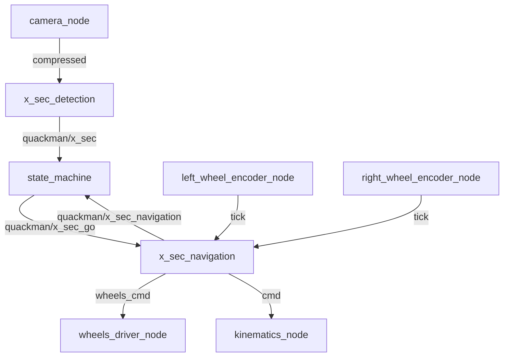

# x-sec-driving
ROS Package of crosssection driving

The cross section driving is part of the QuackMan game and is incorporated as a rospackage. The package consists of two rosnodes `x_sec_detection` and `x_sec_navigation`. During operation the nodes are publishing and subscribing to the following topics. The architectures is given in the subsequent subchapter:

### Detection
#### PUBLISH
- `/quack_man/x_sec`: Crosssection detection flag.
- `/${VEHICLENAME}/xsec_detection/red_line`: Image with detected crosssection line, used for evaluation.

#### SUBRSCRIBE
- `/${VEHICLENAME}/camera_node/image/compressed`: Image stream from rgb camera for crossection detection.

### Navigation
#### PUBLISH
- `/${VEHICLENAME}/kinematics_node/cmd`: forward velocity and angular velocity commands for wheel driver (tacking trim calibration into account).
- `/${VEHICLENAME}/wheels_driver_node/wheels_cmd`: Wheel specific torque gain commands for wheel driver.
- `/quack_man/x_sec_navigating`: Crossection navigation flag. Is set to `true` during crossection navigation. 
  
#### SUBSCRIBE
- `/quack_man/x_sec_go`: Crossection navigation start flag. 
- `/${VEHICLENAME}/left_wheel_encoder_node/tick`: Left wheel encoder ticks for feedback control.
- `/${VEHICLENAME}/right_wheel_encoder_node/tick`: Right wheel encoder ticks for feedback control.
  

## ROS Architecture


## ROS Launch 
To seperatly launch the nodes follow the given steps. 
To launch and test x_sec_detection node: 
```bash
roslaunch x_sec_driving x_sec_detection.launch
```
To launch and test x_sec_navigation
```bash
roslaunch x_sec_driving x_sec_navigation.launch
```

Send as soon as your Bot should navigate: 
```bash
rostopic pub /quack_man/x_sec_go std_msgs/Bool "data: True"
```

